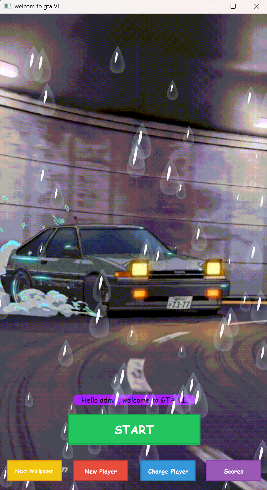
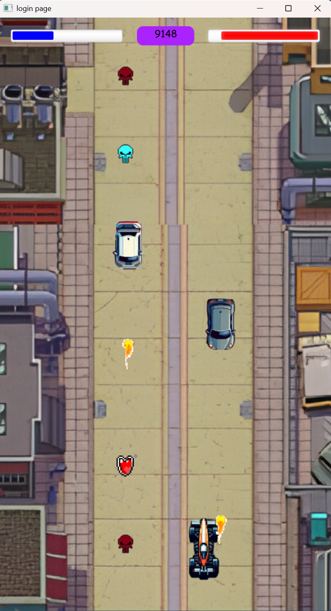
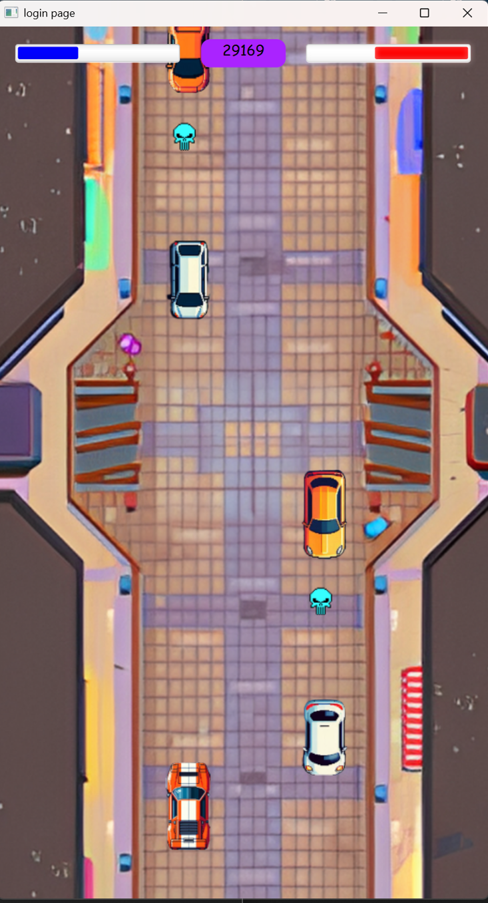
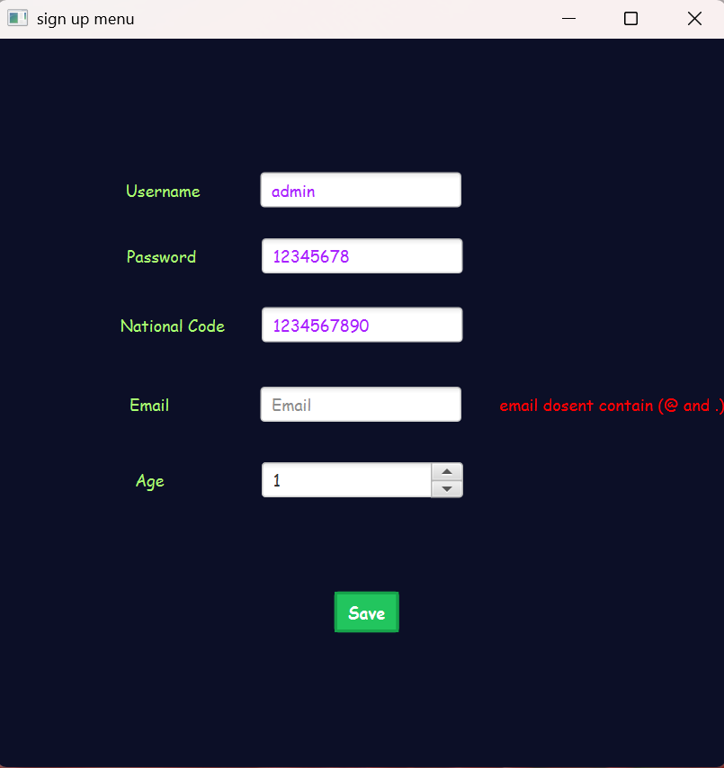

# racing game 

A racing game built to demonstrate Object-Oriented Programming (OOP) concepts.

## About the Project

This is a thrilling racing game where players must navigate their car while facing incoming enemies. The game features three distinct types of enemies, each presenting a unique challenge:

*   **Normal Enemy:** Standard vehicles that block your path.
*   **Shooting Enemy:** Foes that will fire projectiles at your car.
*   **Bomb Dropping Enemy:** Opponents that deploy bombs to impede your progress.

To aid the player, various power-up items can be collected on the track, including:

*   **Fuel:** Replenishes your vehicle's energy.
*   **Health:** Restores your car's durability.
*   **Shield:** Provides temporary invulnerability.

## Screenshots

Here are some glimpses of the game in action:

|  |  |  |
|--------------------------|--------------------------|---------------------------|
| Menu                     | Gameplay 1               | Gameplay 2                |

|  |  |
|---------------------------|------------------------------|
| Scoreboard                | Sign-Up Page                 |


## Key Features

*   **Diverse Enemy Types:** Encounter normal, shooting, and bomb-dropping enemies.
*   **Collectible Items:** Pick up fuel, health, and shield power-ups.
*   **OOP Focused:** Designed to showcase core Object-Oriented Programming principles.

## Getting Started

### Prerequisites

*   Java Development Kit (JDK) 8 or higher
*   Apache Maven

### Installation

You can get a copy of the project up and running on your local machine in a couple of ways:

1.  **Download Latest Release:**
    Download the latest stable release directly from the [Releases section](https://github.com/Amkhodaei83/racing-game/releases).

2.  **Clone and Compile Manually:**
    Clone the repository and build the project using Maven:

    ```bash
    git clone https://github.com/Amkhodaei83/racing-game.git
    cd racing-game
    mvn clean install
    ```

### Running the Game

After installation, you can run the game using Maven:

```bash
mvn exec:java
```

## User Guide (Key Controls)

Control your vehicle with the following keyboard and mouse inputs:

*   **A / D:** Steer Left / Right
*   **Left Click:** Shoot

## Sources & Acknowledgements

We would like to acknowledge the following sources for materials used in this project:

*   **Game Map:** Inspired by the game *Must Deliver*.
*   **Images:** Collected from Pinterest and AI-generated locally (car images).
*   **GIF Wallpapers:** Sourced from TikTok.
*   **Music:** Features tracks from the classic game *Gran Turismo*.

## Contributing

This project is public, but it is not actively seeking external contributions at this time.

## License

Distributed under the MIT License. See `LICENSE` for more information.

```
MIT License

Copyright (c) 2023 racing game

Permission is hereby granted, free of charge, to any person obtaining a copy
of this software and associated documentation files (the "Software"), to deal
in the Software without restriction, including without limitation the rights
to use, copy, modify, merge, publish, distribute, sublicense, and/or sell
copies of the Software, and to permit persons to whom the Software is
furnished to do so, subject to the following conditions:

The above copyright notice and this permission notice shall be included in all
copies or substantial portions of the Software.

THE SOFTWARE IS PROVIDED "AS IS", WITHOUT WARRANTY OF ANY KIND, EXPRESS OR
IMPLIED, INCLUDING BUT NOT LIMITED TO THE WARRANTIES OF MERCHANTABILITY,
FITNESS FOR A PARTICULAR PURPOSE AND NONINFRINGEMENT. IN NO EVENT SHALL THE
AUTHORS OR COPYRIGHT HOLDERS BE LIABLE FOR ANY CLAIM, DAMAGES OR OTHER
LIABILITY, WHETHER IN AN ACTION OF CONTRACT, TORT OR OTHERWISE, ARISING FROM,
OUT OF OR IN CONNECTION WITH THE SOFTWARE OR THE USE OR OTHER DEALINGS IN THE
SOFTWARE.
``` 
